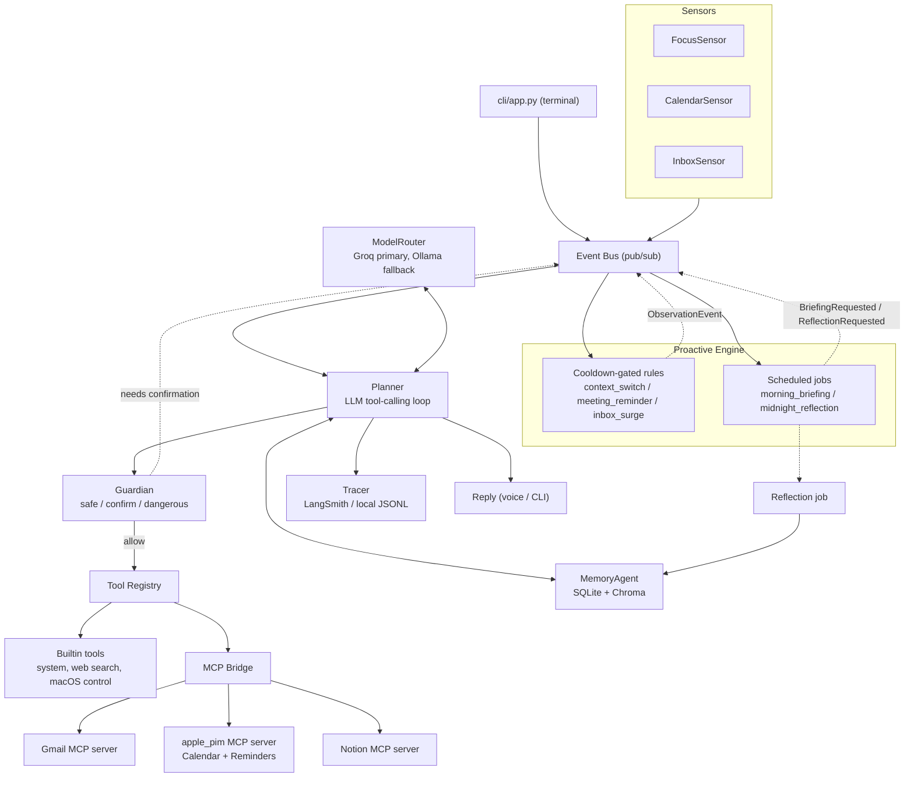
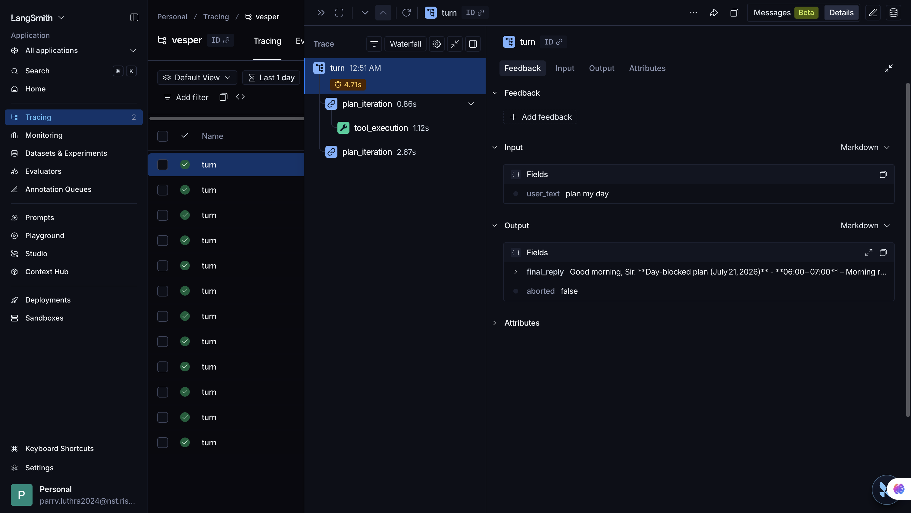

# Vesper

Vesper is a macOS assistant built as a tool-calling operator, not a chatbot. An
LLM planner reasons over a registry of real capabilities — email, calendar,
reminders, task databases, system control — and every consequential action
passes through a permission gate that requires your explicit confirmation
before it runs. It notices things worth mentioning through local sensors
(a context switch, an inbox surge, a meeting five minutes out), remembers
what you tell it across sessions, and degrades gracefully rather than
crashing when a dependency it relies on is unavailable. v1 ships as a rich
terminal application; the **v2 interaction layer** (below) adds a local API
gateway, a frameless always-on-top HUD, and a full voice interface — wake word
→ speech-to-text → spoken reply — all attaching to the same Brain over the
gateway (see [Interaction layer (v2)](#interaction-layer-v2)).

## Architecture



Sensors publish onto a shared event bus; the Proactive Engine turns sensor
events into cooldown-gated observations and runs scheduled jobs (the morning
briefing, nightly memory reflection). Every user turn — spoken, typed, or
proactively triggered — goes through the Planner's tool-calling loop, which
asks the Guardian whether each tool call may run before the Tool Registry
(builtin capabilities plus anything bridged in from an MCP server) actually
executes it. MemoryAgent backs both short-term conversational context and
long-term semantic memory; every turn is traced.

## The persona

Vesper is written as a British butler in temperament, not caricature:
measured, dry when it lands, never enthusiastic, never performative. It says
what needs saying and stops — three sentences by default, observations
raised once and dropped if ignored, never repeated or escalated into
nagging. Honesty is non-negotiable: a failed tool call is reported plainly,
and Vesper never invents a result it doesn't have.

## Capabilities (v1)

- **LLM tool-calling planner** — open vocabulary, no rule-based intent
  switchboard. Groq primary, Ollama local fallback, automatic retry/backoff
  on rate limits.
- **Guardian permission gate** — every tool call is tiered safe / confirm /
  dangerous; confirm-tier calls require an explicit yes, time out to a
  denial, and are appended to a local audit log.
- **Gmail** — triage, search, thread summarization, and reply drafting
  (never sending — that's a deliberate v2 decision) via OAuth2.
- **Calendar + Reminders** — read today's/upcoming events and reminders,
  create new ones (confirm-gated) via EventKit, with an AppleScript
  fallback for reads.
- **Notion** — read-only search, page retrieval, and database queries
  against your named databases.
- **Morning briefing** — inbox triage, today's calendar, carried-over
  items, and an optional day-plan section, delivered on a schedule or
  on demand ("brief me").
- **Day planning** — "plan my day" produces a realistic, time-blocked
  schedule from your calendar, reminders, Notion tasks, and email
  pressure, and protects anything you've told Vesper to treat as
  non-negotiable.
- **Long-term memory** — a nightly (and session-end) reflection pass
  extracts durable facts, preferences, and patterns from conversation
  into semantic memory; relevant memories surface automatically on
  later turns; "forget X" deletes them on request.
- **Proactive sensing** — focus/context-switch tracking, upcoming-meeting
  reminders, inbox-surge detection — all cooldown-gated so nothing repeats
  or nags.
- **Rich terminal presence** — `vesper` (or `python -m vesper`): live plan
  traces as tools execute, streamed replies, inline `[y/N]` confirmations,
  and `/trace` `/tools` `/status` `/quit`.
- **Tracing** — every turn is instrumented as a turn → plan_iteration →
  tool_execution hierarchy in LangSmith, with an always-on local JSONL
  fallback so tracing never breaks the app.
- **Resilience** — an MCP server crashing mid-session is detected, its
  tools disappear from the model's schema rather than failing loudly, and
  it reconnects on its own with exponential backoff. See
  [`docs/TESTPLAN.md`](docs/TESTPLAN.md) for the full list of failure
  drills this release is hardened against.

### A real trace

`turn` → `plan_iteration` → `tool_execution`, exactly as instrumented in
`tracing/tracer.py` — this one is a real "plan my day" call:



## Interaction layer (v2)

Shipped on top of the v1 core. Every surface is a stateless client of one
running Brain, attaching over the gateway — the Brain is the single source of
truth, and adding a surface never touches the planner.

- **API gateway** (`gateway/`) — a FastAPI surface over the event bus:
  WebSocket `/ws` (bearer-token auth, snapshot on connect) plus REST
  `/message`, `/status`, `/confirm`, `/wake`. **Localhost only** (binds
  `127.0.0.1`, refuses anything else). Run: `python -m gateway.server`.
- **HUD** (`hud/`) — a Tauri 2 frameless, always-on-top panel that renders
  Vesper's live event streams: serif voice lines (typewriter), mono
  plan-traces that collapse, gold proactive call-outs, briefing blocks, and
  inline confirmation cards. The evening star breathes when connected and
  dims to an ember when the gateway is gone. Run: `cd hud && npm run tauri dev`.
- **Voice input** (`voice/input/`) — openWakeWord (bundled "hey_jarvis" or a
  custom `.onnx`) → VAD (webrtcvad/silero) → faster-whisper. The transcript is
  injected as just another client message. Run: `python -m voice.input`.
- **Voice output** (`voice/output/`) — Kokoro-82M TTS speaks the serif voice
  lines (never the mono traces); sentence-streamed, with barge-in on wake.
  Run: `python -m voice.output`.
- **The wake reveal** — wake word → the HUD star flares and the panel wakes,
  and Vesper speaks + types the time-appropriate greeting, then listens.

Each is off by default (`gateway.*`, `voice.input.*`, `voice.output.*` in
`config/settings.yaml`); the voice stack's heavy ML deps are optional
(`voice/requirements.txt`).

## Roadmap (v3)

Not yet built, roughly in the order they'd plausibly land:

- **Remote access** — exposing the gateway beyond localhost, which first
  requires real auth (per-user credentials, TLS, rate limiting).
- **Acoustic echo cancellation** — so the spoken greeting doesn't bleed into
  the command capture.
- **Developer tools** — MCP servers for the tools developers live in (a
  shell/terminal server, GitHub, etc).
- **Spotify** — playback control and library access as an MCP server.
- **Creator tools** — integrations aimed at content/creative workflows.
- **Slack / Discord** — presence in team chat, not just a local terminal.

## Setup

### Prerequisites

- macOS (EventKit/AppleScript integrations are Apple-only).
- Python 3.9 for the main app; Python 3.10+ for the MCP servers (see below).
- A [Groq](https://console.groq.com) API key.
- [Ollama](https://ollama.com) running locally, with a fallback model
  pulled (`config/settings.yaml` → `llm.fallback.model`).

### 1. Main application (Python 3.9)

```bash
python3 -m venv .venv
source .venv/bin/activate
pip install --upgrade pip
pip install -r requirements.txt
```

### 2. MCP servers (Python 3.10+)

Gmail, Calendar/Reminders, and Notion each run as a separate MCP server
process under their own virtualenv — the official `mcp` SDK requires
Python 3.10+, which the main app doesn't run on.

```bash
cd mcp_servers
python3.11 -m venv .venv   # any 3.10+ interpreter works
.venv/bin/pip install -r requirements.txt
cd ..
```

### 3. Environment variables (`.env`)

```bash
GROQ_API_KEY=...
LANGSMITH_API_KEY=...          # optional — traces fall back to local JSONL without it
GOOGLE_CLIENT_ID=...           # Gmail OAuth (Desktop app client type in Google Cloud Console)
GOOGLE_CLIENT_SECRET=...
NOTION_API_KEY=...             # optional — an internal integration token
NOTION_DATABASES={"tasks": "<database_id>", "projects": "<database_id>"}  # optional
```

Gmail's first real API call opens a browser for one-time OAuth consent; the
resulting token is cached at `data/google_token.json` (gitignored).
Calendar/Reminders access is a native macOS permission prompt on first use.

### 4. Enable what you want in `config/settings.yaml`

Each capability is independently toggleable under `mcp.servers.*` and
`sensors.*` — everything defaults to a reasonable state for a first run
except Notion, which needs the environment variables above first.

### 5. Run it

```bash
pip install -e .
vesper                  # or: python -m vesper
```

`main.py` remains the full voice-capable entry point (`python main.py`),
running the same `Brain` with `VoiceAgent` enabled instead of the CLI.

## Testing

```bash
pytest                          # unit suite — 198 tests (incl. gateway + voice)
```

See [`docs/TESTPLAN.md`](docs/TESTPLAN.md) for the manual acceptance test
plan — 20 scripted interactions against real services, run before tagging
a release.
