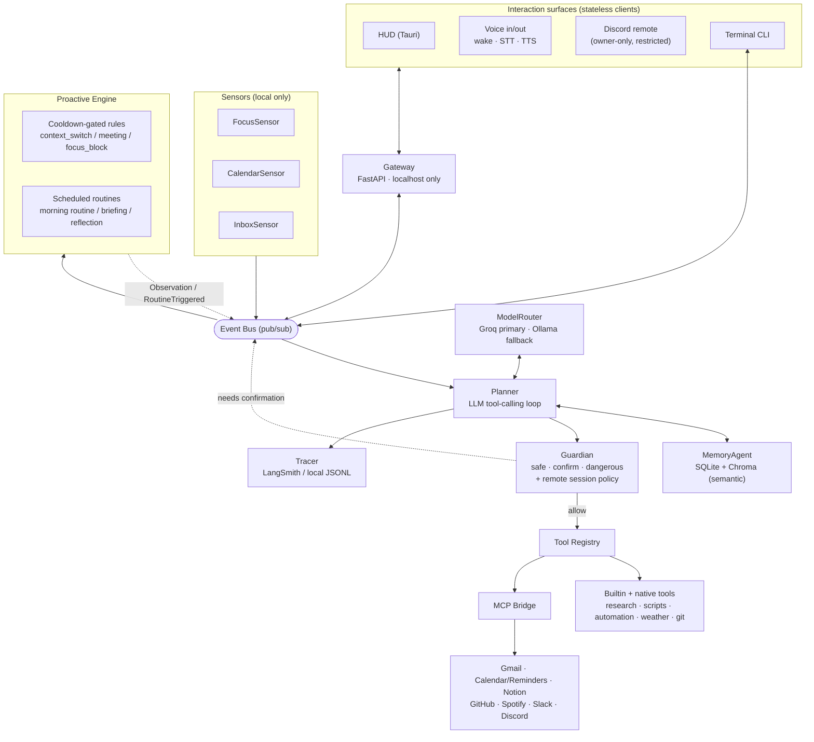
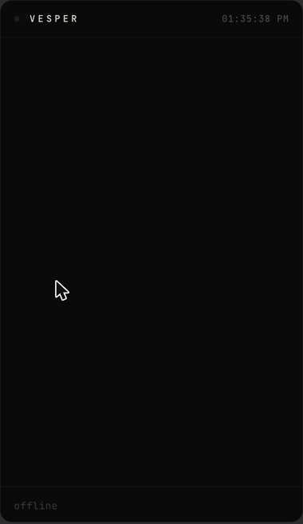
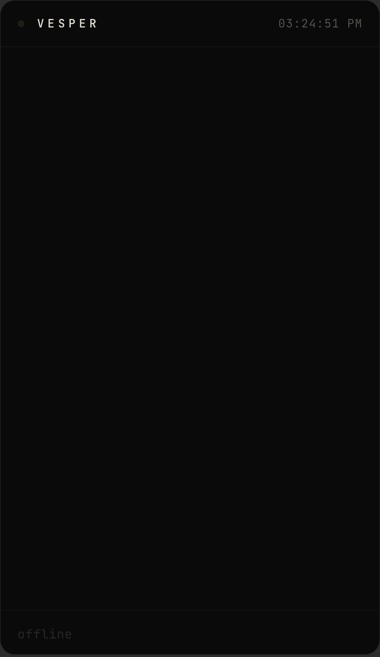

# Vesper

Vesper is a macOS personal assistant built as an **operator with judgment**, not
another task executor. It doesn't wait for a command and dispatch it — it watches
your day through local sensors, reasons over a registry of real capabilities
(email, calendar, code, music, research, team chat, the shell) with an LLM
planner, and gates every consequential action behind a permission tier that asks
before it acts. It notices when something is worth raising — a third context
switch this hour, an inbox surge, a deep-work block starting — forms a view, and
says so once, then drops it. It remembers what you tell it across sessions,
degrades gracefully when a dependency is down, and can run the whole morning for
you before you've asked: weather, what matters today, the three things that need
action, and an offer to set up your workspace — spoken aloud and on a heads-up
display, or reached from your phone over a private Discord channel.

## What makes it different

Most assistants are reactive: you ask, they execute. Vesper is written to have a
point of view. **It observes** — local sensors feed a proactive engine that
tracks focus, calendar, and inbox pressure. **It forms a view** — cooldown-gated
rules decide whether what it noticed is actually worth your attention. **It says
something — respectfully, once** — framed as information plus a question, never a
command, never repeated, dropped the moment you wave it off. That restraint is
enforced in code (cooldowns, once-per-day gates, a single call-out doctrine), not
left to a prompt.

## Architecture



One **Brain** owns the state. Sensors publish onto a shared event bus; the
Proactive Engine turns sensor events into cooldown-gated observations and runs
scheduled routines. Every turn — spoken, typed, proactive, or remote — goes
through the Planner's tool-calling loop, which asks the **Guardian** whether each
call may run before the **Tool Registry** (builtin/native tools plus anything
bridged from an MCP server) executes it. Memory backs both conversational context
and long-term semantic recall. Every interaction surface — CLI, HUD, voice, and
the Discord remote — is a stateless client of that one Brain over the gateway;
**adding a surface never touches the planner.**

## The persona

Vesper is written as a British butler in temperament, not caricature: measured,
dry when it lands, never enthusiastic, never performative. It addresses you as
"Sir", says what needs saying and stops — three sentences by default,
observations raised once and dropped if ignored. Honesty is non-negotiable: a
failed tool call is reported plainly, and it never invents a result it doesn't
have.

## What ships (v3.0.0)

**Core reasoning & safety**
- **LLM tool-calling planner** — open vocabulary, no rule-based intent
  switchboard. Groq primary for every purpose, with a small local Ollama model
  as the rate-limit/offline rescue. Prompts are trimmed per turn (only the
  tools plausibly relevant to the request are sent) and calls are paced against
  the provider's tokens-per-minute ceiling, so multi-step turns finish on Groq
  instead of 429'ing — see [Tuning for an 8GB Mac](#tuning-for-an-8gb-mac).
- **Guardian permission gate** — every tool is tiered `safe` / `confirm` /
  `dangerous`; confirm-tier needs an explicit yes, times out to a denial, and is
  appended to a local audit log. A **session policy** lets a restricted surface
  (the remote interface) lower the ceiling further.
- **Long-term memory** — a nightly + session-end reflection pass distils durable
  facts/preferences into semantic memory; relevant memories resurface on later
  turns; "forget X" deletes them.

**Productivity (MCP)**
- **Gmail** — triage, search, thread summarization, reply *drafting* (never
  sending — a deliberate choice).
- **Calendar + Reminders** — read and create (confirm-gated) via EventKit.
- **Notion** — read-only search, pages, database queries.
- **GitHub** — notifications, PRs, issues, code search (read safe; comment/branch
  confirm). No merge/close/force-push is ever surfaced.
- **Slack / Discord** — mentions, DMs, search (safe); posting/replying
  (confirm — the exact channel + full text is shown before it sends).

**Capability layer (native tools)**
- **Developer tools** — `git status/diff`, gated `git_commit` (shows exact repo +
  branch + message), and `run_tests` on the background task queue.
- **Music** — Spotify playback that's context-aware: name a track and it plays;
  say "focus time" and it *chooses*, honouring remembered preferences.
- **Deep research** — a Search → Reader → Writer → Critic pipeline; runs on the
  queue, announces when ready, writes a sourced report to `data/research/`.
- **Script writer** — template-driven from `config/formats/*.md` (new formats =
  new markdown, no code).
- **Automation composer** — `run_shell` / `run_applescript`, DANGEROUS-tier: the
  command is shown **verbatim**, approved every time, and a denylist refuses
  `rm -rf /`, `sudo`, disk utilities, `curl | sh`, and writes outside `$HOME`
  **outright — even after approval.**
- **Weather** — Open-Meteo, no API key.

**Proactive & routines**
- **Morning routine** — fires at a wake time or on your first activity of the
  day; delivers one composed briefing (weather → what matters → top-3 → day plan)
  spoken + on the HUD, then offers to set up your workspace as a single
  confirmation. At most once per day; "not now" defers it, twice cancels it.
- **Sensing** — context-switch, meeting, focus-block, and inbox-surge rules, all
  cooldown-gated so nothing nags.
- **Morning briefing & day planning** — on schedule or on demand ("brief me",
  "plan my day").

**Interaction surfaces**
- **Terminal CLI** — live plan traces, streamed replies, inline `[y/N]`
  confirmations, `/trace` `/tools` `/status`.
- **HUD** (Tauri) — frameless always-on-top panel: serif voice lines, collapsing
  mono traces, gold call-outs, confirmation cards, a breathing star.
- **Voice** — openWakeWord → VAD → faster-whisper in; Kokoro-82M TTS out; a
  cinematic wake reveal.
- **Discord remote** — mobile access with no app: owner-only, dangerous tools
  disabled entirely, confirm-tier requiring an explicit remote approval (the
  request id or a ✅ reaction — never a bare "yes").
- **Gateway** — FastAPI over the bus, **localhost only** (binds `127.0.0.1` and
  refuses anything else), bearer-token auth.
- **Tracing** — every turn as `turn → plan_iteration → tool_execution` in
  LangSmith, with an always-on local JSONL fallback.
- **Resilience** — a crashed MCP server drops out of the model's schema and
  reconnects on its own with backoff. See [`docs/TESTPLAN.md`](docs/TESTPLAN.md).

## What is deliberately *not* built

Restraint is a feature. These were considered and left out on purpose:

- **WhatsApp integration** — the unofficial APIs are a terms-of-service and
  account-ban risk; I won't ship something that can get a user's number banned.
- **A general browser agent** — driving arbitrary sites with real credentials is
  a safety and prompt-injection surface I'm not willing to expose behind an
  autonomous planner.
- **Home automation** — no hardware to control, and simulating it would be
  theatre, not a capability.

## Screenshots

**The HUD in a live session** — serif voice lines, mono plan-traces, and the
breathing star:



**A call-out moment / the wake reveal** — the star flares as Vesper wakes and
greets:



**A real LangSmith trace** — `turn → plan_iteration → tool_execution`, exactly as
instrumented in `tracing/tracer.py` (a real "plan my day" call):


## Setup

A stranger should be able to reach a working greeting from this section alone.

### Prerequisites

- **macOS** (EventKit/AppleScript integrations are Apple-only).
- **Python 3.9–3.11** for the main app (verified on 3.9 and 3.11). Use an
  explicit `python3.11` (or `python3.9`) — a bare `python3` that resolves to
  3.12+ may lack wheels for the pinned native deps. The MCP servers need
  **Python 3.10+**.
- A [Groq](https://console.groq.com) API key **or** [Ollama](https://ollama.com)
  running locally with a model pulled — either one alone is enough to get a
  greeting; with both, Groq is primary and Ollama is the rescue fallback. On a
  machine with 8GB of RAM, pull `llama3.2:3b` and read
  [Tuning for an 8GB Mac](#tuning-for-an-8gb-mac) before pulling anything larger.

### 1. Main application (Python 3.9–3.11)

```bash
git clone <this-repo> vesper && cd vesper
python3.11 -m venv .venv        # explicit version — not a bare `python3`
source .venv/bin/activate
pip install --upgrade pip
pip install -r requirements.txt
pip install -e .
```

### 2. Minimum to a greeting

```bash
cp .env.example .env   # if present; otherwise create .env (see below)
```

`.env` needs just one working model provider to start:

```bash
GROQ_API_KEY=...        # from console.groq.com — the fastest path to a greeting
# (or run `ollama serve` with the fallback model pulled and skip the key)
```

Then run:

```bash
vesper                  # rich terminal CLI  (or: python -m vesper)
```

You should get **"Good morning, Sir."** (or the time-appropriate greeting). That
is the verification target — everything below is optional capability.

### 3. Optional — MCP servers (Python 3.10+)

Gmail, Calendar/Reminders, and Notion each run as a separate MCP process under
their own virtualenv (the official `mcp` SDK needs 3.10+, which the main app
doesn't run on):

```bash
cd mcp_servers
python3.11 -m venv .venv        # any 3.10+ interpreter
.venv/bin/pip install -r requirements.txt
cd ..
```

### 4. Optional — more environment variables (`.env`)

```bash
LANGSMITH_API_KEY=...           # traces fall back to local JSONL without it
GOOGLE_CLIENT_ID=...            # Gmail OAuth (Desktop app client type)
GOOGLE_CLIENT_SECRET=...
NOTION_API_KEY=...              # internal integration token
NOTION_DATABASES={"tasks":"<id>","projects":"<id>"}
GITHUB_PERSONAL_ACCESS_TOKEN=...# GitHub MCP
TAVILY_API_KEY=...              # deep-research web search
VESPER_DISCORD_TOKEN=...        # Discord remote interface bot token
```

Gmail's first API call opens a browser for one-time OAuth (token cached at
`data/google_token.json`, gitignored). Calendar/Reminders is a native macOS
prompt on first use.

### 5. Optional — enable what you want in `config/settings.yaml`

Every integration and surface is independently toggleable and **defaults off**:
`mcp.servers.*` (gmail/apple_pim on by default, others off), `sensors.*`,
`proactive.morning_routine.*`, `remote.*`, `gateway.*`, `voice.*`. Enable only
what you have credentials for.

### 6. Optional — the other surfaces

```bash
python -m gateway.server     # localhost API gateway (needed by HUD/voice/remote)
cd hud && npm install && npm run tauri dev   # the HUD
python -m voice.input        # wake word + STT   (needs voice/requirements.txt)
python -m voice.output       # Kokoro TTS
python main.py               # full voice-capable entry point (VoiceAgent instead of CLI)
```

## Tuning for an 8GB Mac

Vesper is tuned to stay on Groq for essentially everything and to treat a local
model as a rescue path, not a daily driver. On 8GB that distinction is the
whole ballgame: a 7B model at Q4 does not fit alongside macOS and the app, so it
swaps and drags the entire machine down.

**Staying under Groq's free tier (8k tokens/minute).** Three changes, largest
first:

| Lever | Effect |
|---|---|
| Per-turn tool filtering (`llm.tool_selection`) | Only the tools plausibly relevant to the request are sent, instead of all 27 on every call. ~67% off the tool schema. |
| Trimmed persona | 813 → 519 tokens, same rules, less padding. |
| Bounded history replay | Last 4 turns, hard-capped at 800 tokens, so a long session stops inflating every call. |

Measured end to end against real Groq calls: **1,849 → 851 `tokens_in` per
planning call (-54%)**, which takes an 8k minute from ~4 calls to ~9.

Two mechanisms then keep a burst on Groq rather than dropping it to the local
model — client-side pacing (a rolling 60s token budget briefly delays a call
that would cross the ceiling) and honoring the `retry-after` Groq sends on a
429. A four-turn burst of twelve planning calls completes 12/12 on Groq.

Reproduce either measurement yourself:

```bash
.venv/bin/python scripts/smoke_token_budget.py   # before/after tokens_in
.venv/bin/python scripts/smoke_rate_limit.py     # 4 rapid multi-step turns
```

**The local fallback.** Pull the 3B — not a 7B, and not the coder model:

```bash
ollama pull llama3.2:3b
```

Start Ollama with the memory settings that matter on 8GB:

```bash
./scripts/ollama_env.sh
```

That sets `OLLAMA_KEEP_ALIVE=30s` (unload when idle, handing ~2.5GB back to the
OS), `OLLAMA_CONTEXT_LENGTH=2048` (smaller KV cache), and
`OLLAMA_MAX_LOADED_MODELS=1`. Vesper also sends `keep_alive` and `num_ctx` on
every request, so the unload behavior holds even against a server you started by
hand. Verified on an 8GB M3: the model loads 100% on GPU at 2.5GB, and
`ollama ps` shows it gone ~30s after the last call.

Crossing to the local model announces itself ("Switching to local, Sir — one
moment"), because the cold load is not fast. Measured on this machine:

| | Latency |
|---|---|
| Warm (model already resident) | **0.9s** |
| Cold load with healthy free RAM | a few seconds |
| Cold load at ~1GB free (real memory pressure) | **37.8s** |

That last row is the case the notice exists for, and the reason `doctor.py`
warns below 3GB free: the load itself is fine, but paging a 2.5GB model into a
full machine is not. It is also why this path is a rescue and not the default —
Groq answers the same prompt in under a second.

**Check headroom before you start:**

```bash
.venv/bin/python scripts/doctor.py
```

It reports total RAM, current memory pressure via `vm_stat`, and warns below
3GB free — the point past which loading even a 3B will swap. It also pings
Ollama and tells you whether the configured fallback model is actually pulled.

## Testing

```bash
pytest                       # automated unit suite — 293 tests
```

See [`docs/TESTPLAN.md`](docs/TESTPLAN.md) for the manual acceptance plan (33
scripted interactions against real services) and
[`docs/ARCHITECTURE.md`](docs/ARCHITECTURE.md) for the design decisions and *why*
they were made.
