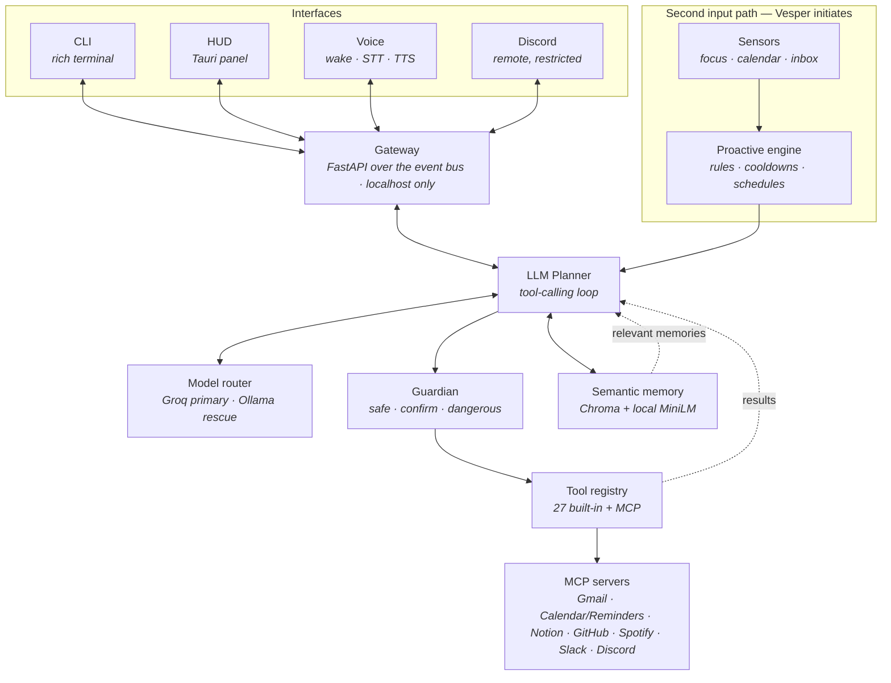
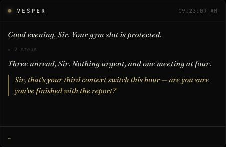

# Vesper

**An operator with judgment — a proactive AI chief of staff for macOS that observes, reasons, and acts, then tells you when you're getting in your own way.**

Vesper runs locally on a Mac, plans over a registry of ~40 tools with an LLM, and gates every consequential action behind a permission tier before it executes. It watches what you're actually doing — which app has focus, what's on your calendar, what's unread — and when that context is worth raising, it raises it. Voice in, voice out, and a slim always-on-top panel that shows its reasoning as it works.


*The HUD across one exchange: idle → wake flare → spoken greeting → tool traces → reply → the call-out → back to idle.*

---

## What makes it different

Most assistants are reactive executors: you ask, they do, they wait. Vesper has a **sensor → proactive engine → persona** loop that lets it *initiate* — sensors observe machine state, the engine decides whether anything is worth saying, and the persona governs how it's said.

The respectful call-out is a first-class feature, not a gimmick: *"Sir, that's your third context switch this hour — are you sure you've finished with the report?"* It is raised once, never repeated, framed as information plus a question rather than a command, and it never blocks what you actually asked for.


That restraint is enforced in code — cooldowns, once-only delivery, and a persona that bans moralising — because an assistant that interrupts badly is worse than one that stays quiet.

---

## Architecture



Every surface is a client of the same gateway, so the CLI, the HUD, voice, and the remote interface all drive one brain — there is no privileged path.

---

## How it works

- **The planner plans over tools.** There is no intent catalogue and no `unknown intent` branch. Every input goes to an LLM tool-calling loop that either calls a tool or answers in plain text — an open vocabulary rather than a fixed switchboard. → [`orchestrator/planner.py`](orchestrator/planner.py)
- **The Guardian gates.** Every tool carries a tier: `safe` runs, `confirm` needs an explicit yes and times out into a denial, `dangerous` is refused outright on restricted surfaces. Consequential actions cannot reach execution without passing it. → [`guardian/gate.py`](guardian/gate.py)
- **Sensors observe.** Focus changes, upcoming meetings, and unread mail become *pending observations* that ride into the planner's context block — the second input path that lets Vesper speak first. → [`sensors/`](sensors/), [`proactive/engine.py`](proactive/engine.py)
- **Memory reflects.** A session-end pass distils a transcript into at most five durable items, each typed `preference` / `fact` / `pattern`, embedded locally with MiniLM so recall is by meaning, not keywords. → [`proactive/reflection.py`](proactive/reflection.py), [`rag/rag_service.py`](rag/rag_service.py)
- **Everything is a tool.** Built-ins and MCP servers register into one registry with one schema, so adding a capability is a registration, not a new code path. → [`tools/registry.py`](tools/registry.py), [`tools/mcp_bridge.py`](tools/mcp_bridge.py)

---

## What ships

| Capability | Detail |
|---|---|
| **LLM planner** | Tool-calling loop, ~40 tools, 6-iteration cap, per-turn tool filtering (−54% prompt tokens) |
| **Guardian** | 3 tiers, confirmation cards with a 120s window, local audit log, per-surface policy |
| **Proactive engine** | Focus / calendar / inbox sensors, once-only call-outs, cooldowns, scheduled routines |
| **Semantic memory** | Chroma + `all-MiniLM-L6-v2` locally; 5/5 vs 2/5 top-1 recall against the previous hash embeddings |
| **Voice in** | openWakeWord → WebRTC VAD → faster-whisper `base.en` (0.14× realtime) |
| **Voice out** | Kokoro-82M, `bm_lewis` (lowest-register British voice by measured F0), 0.55× realtime |
| **HUD** | Tauri always-on-top panel: serif voice lines, mono plan traces, gold call-outs, confirmation cards |
| **Gateway** | FastAPI over the event bus, localhost-bound, bearer-token auth |
| **MCP** | Gmail and Apple Calendar/Reminders enabled; Notion, GitHub, Spotify, Slack, Discord shipped behind config flags |
| **Remote** | Discord interface: owner-only, `dangerous` disabled entirely, confirms need an explicit approval |
| **Tracing** | LangSmith when configured, always-on local JSONL otherwise |
| **Tests** | 331 automated |

### Deliberately not built (and why)

- **WhatsApp integration.** Automating a personal WhatsApp account risks a ban under their terms. The value doesn't justify handing someone a bricked account.
- **Autonomous browser agent.** A tool that can click anything on any page cannot be meaningfully bounded by a permission tier. The safety model here is per-tool and legible; a browser agent breaks it.
- **Heavy always-on local LLM.** This runs on an 8GB M3. A 7B model at Q4 does not fit beside macOS and the app — it swaps and drags the whole machine down. Groq serves the planner; a 3B Ollama model exists purely as a rate-limit/offline rescue and unloads after 30s idle. Constraint honesty beats a spec-sheet feature.

---

## Screenshots

| HUD, live session | LangSmith trace tree |
|---|---|
|  |  |
| Serif voice lines over collapsed mono traces; the gold call-out is the only gold body text. | One turn: nested plan iterations and tool execution with real latencies. |

---

## Tech stack

Python 3.11 · Groq (`gpt-oss-120b`) with an Ollama `llama3.2:3b` rescue · Chroma + sentence-transformers · Model Context Protocol · FastAPI + WebSockets · Tauri 2 + TypeScript · openWakeWord · faster-whisper · Kokoro-82M · LangSmith.

---

## Setup

**Requires macOS** (Vesper drives AppleScript and EventKit) and **Python 3.11**.

> Use an explicit `python3.11`. A bare `python3` resolving to 3.12+ may lack wheels for the pinned native audio dependencies. The MCP servers need their own 3.10+ virtualenv.

```bash
git clone <this-repo> vesper && cd vesper
brew install portaudio espeak-ng          # microphone + TTS phonemizer
python3.11 -m venv .venv && source .venv/bin/activate
pip install --upgrade pip && pip install -r requirements.txt && pip install -e .
```

Add a [Groq](https://console.groq.com) key — the only cloud dependency, free tier is enough:

```bash
echo "GROQ_API_KEY=..." >> .env
```

Run it:

```bash
vesper            # rich terminal CLI
```

You should get **"Good morning, Sir."** That is the verification target; everything below is optional.

<details>
<summary><b>Optional — voice, HUD, local rescue</b></summary>

```bash
# Local LLM rescue for when Groq rate-limits (8k tokens/min free tier).
# The 3B is deliberate — do not raise it to a 7B on an 8GB machine.
ollama pull llama3.2:3b
./scripts/ollama_env.sh        # sets OLLAMA_KEEP_ALIVE=30s so it unloads when
                               # idle and hands its ~2.5GB back to the OS
# Voice (model files are gitignored, ~340MB once):
pip install -r voice/requirements.txt
cd voice/models
curl -LO https://github.com/thewh1teagle/kokoro-onnx/releases/download/model-files-v1.0/kokoro-v1.0.onnx
curl -LO https://github.com/thewh1teagle/kokoro-onnx/releases/download/model-files-v1.0/voices-v1.0.bin

# Then, in separate terminals:
python -m gateway.server                    # the brain
cd hud && npm install && npm run tauri dev  # the panel
python -m voice.input                       # wake word + STT
python -m voice.output                      # Kokoro TTS
```

`python scripts/doctor.py` checks every dependency and reports memory headroom before you start a local model.
</details>

---

## Roadmap

**Shipped** — LLM planner · Guardian tiers · proactive sensors and call-outs · semantic memory with reflection · Gmail and Calendar over MCP · gateway · Tauri HUD with the wake flow · voice in and out · Discord remote · tracing · 8GB-tuned routing with rate-limit survival.

**Planned**
- Custom wake word (`"wake up daddy's home"`). The pipeline, trainer, and config swap are done and verified on a pretrained model; the phrase itself needs ~30 voice recordings and a one-time GPU run — see [`voice/TRAINING.md`](voice/TRAINING.md).
- Enabling the built-but-dormant MCP servers (Notion, GitHub, Spotify, Slack) beyond Gmail and Calendar.
- Screen-context vision, reworked from the retired v1 implementation.
- Multi-step routine authoring from natural language.

---

## Documentation

[Architecture](docs/ARCHITECTURE.md) · [Test plan](docs/TESTPLAN.md) · [Demo checklist](docs/DEMO.md) · [Wake-word training](voice/TRAINING.md) · [Voice output](voice/output/README.md)

```bash
pytest    # 331 tests
```
