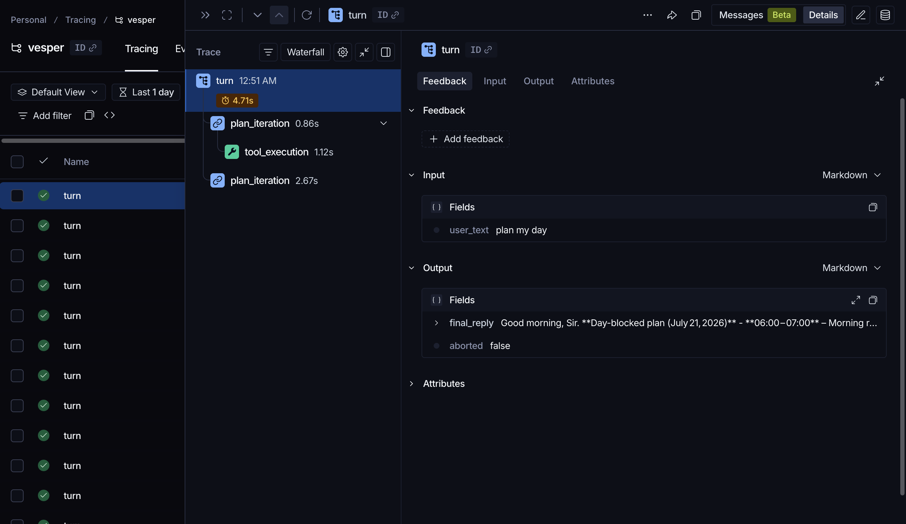
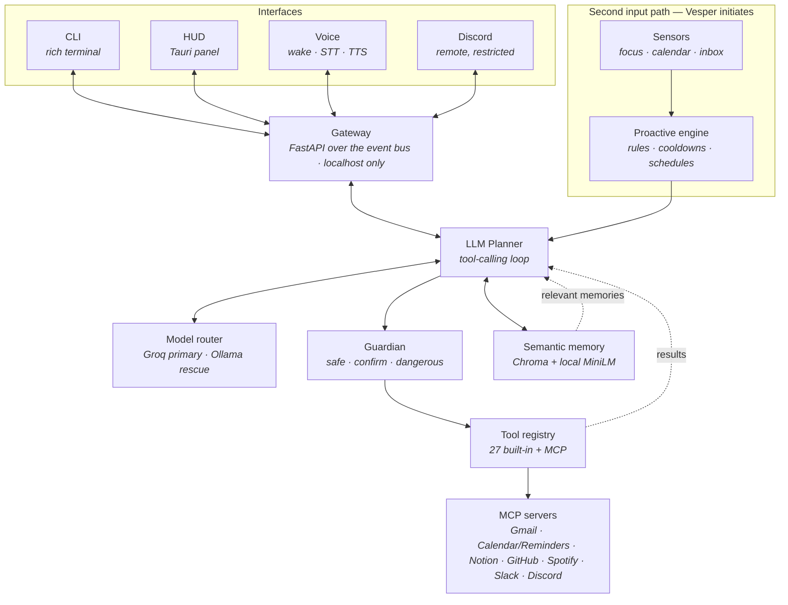

# Vesper — Architecture & Decisions

This document explains *why* Vesper is shaped the way it is. Each section states the decision, the alternatives rejected, and the reasoning. Read top to bottom it is roughly a ten-minute walkthrough of the system.

---

## 1. The core thesis: proactivity is an architectural constraint, not a feature

Almost every assistant is a **reactive executor**: a request arrives, it is classified, something runs, a response goes back. The loop starts with the user and ends with the user. Nothing happens in between.

Vesper's premise is that the valuable part of a chief of staff is the part that *speaks first* — the observation you didn't ask for. *"That's your third context switch this hour — are you sure you've finished with the report?"* Nobody requests that. It only exists if the system is watching.

That single requirement rules out request/response as the whole architecture. If the only way into the reasoning layer is a user message, then by construction the assistant can never initiate. Proactivity is not something you add to a request/response system later; it changes what the system *is*.

**The decision:** the planner has **two entry paths**. One is a user turn from any interface. The other is the sensor → proactive engine path, which feeds observations into the planner's context without a user message existing at all.

**Alternatives rejected:**

- *Cron jobs that post canned messages.* Simple, but the output isn't reasoned — it can't take the current situation into account, and it can't shut up when the observation isn't worth making. It's a notification system wearing an assistant's clothes.
- *Ask the LLM on every turn "is there anything you'd like to raise?"* This makes proactivity dependent on the user speaking first, which is precisely the thing we're trying to escape, and it burns tokens on every turn to usually answer "no".
- *A separate "proactive agent" with its own model and voice.* Two systems with two personalities, two sets of tools, and two ways to be wrong. The observation should come from the same reasoning and the same voice as everything else.

Everything downstream follows from this: sensors have to be cheap enough to run continuously, observations have to be *suggestions* to a reasoner rather than commands, and the discipline that stops it becoming annoying has to be mechanical rather than a polite request in a prompt.

---

## 2. The planner: an LLM tool-calling loop, not an intent router

### The before/after

This is a real rewrite, and the diff is the argument. The original implementation (commit `f162849`) routed through a hardcoded switchboard in `orchestrator/brain.py`:

```python
INTENT_ROUTING: Dict[str, Dict[str, Any]] = {
    "open_application": {"agent": "SystemAgent", "action": "open_app"},
    "open_app":         {"agent": "SystemAgent", "action": "open_app"},
    "close_application":{"agent": "SystemAgent", "action": "close_app"},
    ...                                          # 79 entries
}
```

with the failure mode that defines this design:

```python
routing = INTENT_ROUTING.get(intent)
if not routing:
    logger.warning(f"No routing found for intent: {intent}")
    await self._request_clarification(f"I'm not sure how to handle '{intent}'.")
```

Three problems, in increasing order of seriousness:

1. **79 hand-maintained string keys**, with aliases (`open_app` *and* `open_application`) because natural language doesn't respect your enum.
2. **A closed vocabulary.** Anything outside the dict produced "I'm not sure how to handle that." The assistant's capability ceiling was a Python literal.
3. **Multi-step requests needed their own parser** — `_parse_multi_step_command` split compound instructions with string surgery. Every new phrasing was a new branch.

Commit `16f244a` replaced all of it. Exact churn: `brain.py` **+187 / −788**, `langgraph_brain.py` **+11 / −866**, and two new files — `orchestrator/planner.py` at 235 lines and `tests/test_planner.py` at 331. The routing layer cost more than three times what replacing it did.

### The separation

**The planner decides WHAT. Tools know HOW.**

The planner never contains a branch about volume, or Safari, or Gmail. It runs one loop: send the conversation plus the tool schema to a model, and either the model returns text (that's the reply, stop) or it returns tool calls (execute them, append results, loop). Domain knowledge lives entirely in the tool implementations.

The consequence that matters: **adding a capability never touches the planner.** A tool registers itself with a name, a description, a JSON schema, and a tier. The planner picks it up because it reads the registry, not because anyone wired it in. There is no `if intent == ...` to extend, and no "unknown intent" branch to fall into — the model either finds a tool that fits or answers in plain text. Open vocabulary.

### The loop

```
user text ─→ planner ─→ model call (persona + context + tool schema)
                 │
                 ├─ no tool calls ──────────────→ reply, done
                 │
                 └─ tool calls
                        │
                        ├─→ Guardian.check(tool, args)
                        │      safe      → allow
                        │      confirm   → emit ConfirmationRequestedEvent, block on resolution
                        │      dangerous → allow only if the session policy permits
                        │
                        ├─→ execute (local handler, or a bus round trip to an agent)
                        │
                        └─→ append the result as a tool message ──→ loop (max 6 iterations)
```

The iteration cap is a real safeguard, not a formality: it bounds cost and stops a confused model looping forever. Exhausting it produces a graceful admission rather than a hang.

**Alternatives rejected:**

- *Keeping the intent classifier and using the LLM only to fill slots.* This keeps the closed vocabulary — the exact defect being removed.
- *A LangGraph state machine.* An alternate `StateGraph` orchestrator existed in `langgraph_brain.py` — and the honest version of this story is more embarrassing than "we evaluated it": `orchestrator/__init__.py` was exporting `Brain` from *that* file, so `main.py` had never been running the code the rewrite targeted, and ~800 lines of it were a never-imported second implementation left from an earlier migration. That is its own lesson about dead code (see §10). On the merits: for a loop this shape — call model, maybe call tools, repeat — an explicit `for` loop is more readable, more debuggable, and has no framework semantics to reason about. Graph frameworks earn their weight on genuinely branching multi-agent topologies; this isn't one.
- *Letting the model emit shell commands directly instead of typed tools.* Maximum flexibility, no schema to maintain — and no way to attach a permission tier to an action, because there are no discrete actions any more. That trade is unacceptable (see §4).

---

## 3. The tool registry and MCP: the extensibility story

**Every capability is a tool.** Opening an app, committing to git, reading the inbox, checking the weather — all the same shape: name, description, JSON Schema parameters, permission tier, and either a local async handler or an agent/action pair routed over the event bus.

Uniformity is what buys the properties. Because everything is a tool: the planner sees one schema; the Guardian gates one chokepoint; the tracer records one span type; the HUD renders one kind of trace line. A capability that isn't a tool would need its own path through all four.

**MCP over hardcoded integrations.** External services (Gmail, Apple Calendar/Reminders, Notion, GitHub, Spotify, Slack, Discord) are [Model Context Protocol](https://modelcontextprotocol.io) servers, not Python modules in this repo.

Why:

- **The bridge is generic.** `tools/mcp_bridge.py` connects to a configured server, asks it what tools it has, and registers each one into the same registry as a `ToolSpec`. Adding a server is a config block. **Zero planner changes, zero registry changes, zero new code paths** — the planner cannot tell an MCP tool from a built-in one.
- **Process isolation.** Each server is a subprocess. A Gmail server that hangs or crashes cannot take down the assistant; the bridge marks its tools unavailable and reconnects with backoff. Tool names stay registered across a reconnect, so nothing else needs to know it happened.
- **Version independence.** The MCP SDK needs Python 3.10+; the main app targets 3.9+. Separate processes means separate interpreters, and the Gmail integration's dependency tree cannot conflict with the app's.
- **Portability.** An MCP server written for Vesper works in any MCP client, and vice versa. Hardcoded integrations are captive.

Two details worth noting. **Name collisions** are resolved at registration — two servers both exposing `post_message` get the first bare and the second prefixed, without either server knowing. And an **expose allowlist** lets a server's dangerous surface be withheld entirely: the GitHub server ships with 8 of its tools exposed, so merge and force-push are not merely gated, they are never offered to the model.

---

## 4. The Guardian: why an LLM composing shell commands mandates a permission model

Every tool declares a tier:

| tier | behaviour |
|---|---|
| `safe` | runs immediately — reads, queries, anything without consequence |
| `confirm` | requires explicit approval; 120s timeout resolves to **denial**, never to approval |
| `dangerous` | approval plus a session ceiling that can refuse it outright |

The Guardian sits between the planner's decision and execution. It never executes anything; it only returns a verdict. That separation keeps the security-relevant logic small and testable.

**Why this is mandatory, not nice-to-have.** Vesper has `run_shell` and `run_applescript`. A language model composes the argument. That means the system's blast radius is "whatever a probabilistic text generator decided to write, on your actual machine." Everything else in the design is downstream of taking that seriously.

Three layers, deliberately distinct:

**1. Tier gating.** The model chooses the tool; it does not choose the tier. A tier is a property of the tool, declared at registration, outside the model's reach. The model cannot promote its own permissions because it never sees a lever to pull.

**2. The session ceiling.** A restricted surface lowers the ceiling for a whole turn. The Discord remote runs with `allow_dangerous=False`, so dangerous-tier tools are **denied outright — never even offered for confirmation.** The reasoning: approving a destructive action from a phone, in a chat client, is exactly where a mis-tap is most likely and context is thinnest.

The policy is task-scoped via `contextvars`, not a global, so a restricted remote turn cannot leak its ceiling into a concurrent local turn — and, more importantly, a local turn cannot leak *its* permissiveness into a remote one.

**3. The denylist that overrides approval.** Confirmation is not the last line. `tools/creator.py` refuses a set of patterns outright, **regardless of what anyone approves**:

```python
r"\brm\s+-[a-zA-Z]*r[a-zA-Z]*f?[a-zA-Z]*\s+(/|~|/\*|\$HOME)",  # rm -rf /
r"\bsudo\b",
r"(curl|wget)\s[^|]*\|\s*(sudo\s+)?(sh|bash|zsh|python\d?)\b", # curl … | sh
r"\bdd\b[^\n]*\bof=/dev/",                                     # dd of=/dev/…
r":\s*\(\s*\)\s*\{\s*:\s*\|\s*:\s*&\s*\}",                     # fork bomb
```

Config can *add* patterns; it can never weaken these. This exists because confirmation fatigue is real: a user approving their ninth prompt of the day is not meaningfully consenting. Some actions should not be reachable by clicking yes while distracted.

**The audit log.** Every non-safe verdict appends to `data/audit.jsonl` — tool, arguments, verdict, who approved. Local, append-only, greppable. Without it, "did it do that because I told it to?" is unanswerable, and for a system that acts autonomously that question must have an answer.

**Alternatives rejected:**

- *Ask the LLM whether an action is dangerous.* Self-assessed permissions are not permissions. The component being restrained cannot be the one deciding the restraint.
- *Confirm everything.* Users stop reading. A prompt that always appears carries no information; the tiers exist so that a confirmation still means something when it appears.
- *A sandbox instead of a permission model.* Sandboxing a macOS assistant defeats its purpose — controlling the real machine *is* the product. The tier model constrains what may be attempted rather than pretending the effects aren't real.

---

## 5. Sensors and the proactive engine: enforcing restraint mechanically

Three sensors, all cheap and all local: **focus** (frontmost app via NSWorkspace, 5s), **calendar** (EventKit, 5min), **inbox** (via the Gmail MCP tool, not a second mail client).

**Local-only, deliberately.** A sensor observes what you are doing all day. Nothing a sensor sees leaves the machine except as a short context line handed to the planner for a specific turn — and that is a design commitment, not an implementation detail. An assistant that streams your app-usage telemetry to a server is a different product with a different trust model, and not one I'd want running.

**The passive doctrine is enforced in code, not in the prompt.** The persona says to raise an observation once, frame it as information plus a question, never moralise, and drop it if dismissed. That is necessary but *not sufficient* — a prompt is a request, and a model under pressure will eventually ignore it. So the properties that matter are structural:

- **Per-kind cooldowns.** Context-switch call-outs are gated at 90 minutes, meeting reminders at 10, focus blocks at 120. The rule cannot fire again inside its window no matter what the model would like to say.
- **Once-only delivery.** Pending observations are handed to the planner and then **consumed — win or lose**. Whether or not the model chose to voice it, the observation is gone. It cannot resurface next turn and become nagging.
- **Never blocking.** Observations ride *alongside* the user's request in the context block. They are never a precondition, and they cannot hijack a turn.

The flow: sensor detects → engine evaluates the rule and its cooldown → an `ObservationEvent` becomes a pending observation → the next turn's context block includes it → the persona governs whether and how it is voiced → it is consumed regardless.

The model gets to decide *whether it's worth saying*, which is the part that needs judgment. It does not get to decide *how often it may say things*, which is the part that needs a clock.

**Alternatives rejected:**

- *Prompt-only discipline.* "Please don't repeat yourself" is not a guarantee. Cooldowns are.
- *A fixed notification schedule.* Predictable, ignorable, and blind to whether the observation is currently relevant.
- *Cloud-analysed activity data.* Better pattern detection, unacceptable privacy cost for a thing watching your screen all day.

---

## 6. Memory: two tiers, because they answer different questions

**Short-term** lives in SQLite with TTLs — conversation turns expire after 2 hours, commands after 30 minutes, generic short-term after 1. It answers *"what were we just doing?"* and is worthless a day later.

**Long-term** lives in Chroma with local embeddings. It answers *"what is true about this person?"* and should survive indefinitely.

**Why not save everything.** Logging every turn into long-term memory is easy and actively harmful. Retrieval quality degrades as the store fills with transient noise — "open Safari" is not a durable fact — and every irrelevant memory retrieved is prompt budget spent on making the model *worse* informed. The store's value is its signal-to-noise ratio, and the only way to protect that is to be strict at the write path.

**The write path is a reflection pass, not a logger.** At session end an LLM pass reads the transcript and extracts **at most five** items, each typed `preference`, `fact`, or `pattern`, with an explicit instruction that one-off requests and transient task details do not qualify. Anything not matching the typed format is discarded.

Putting the filter at the *write* path rather than the read path is the key decision. A permissive store with clever retrieval still pays to search noise and still surfaces it on a bad day. A disciplined store stays small enough that retrieval is easy.

**Semantic retrieval.** Recall uses `all-MiniLM-L6-v2` locally — 384-dim, ~90MB, CPU-only, loaded lazily and cached. This replaced a hash-based fallback that only matched shared words. The difference is measurable: on a benchmark of lexically-disjoint query/memory pairs, hashing scores **2/5** top-1 (both hits accidents of a shared stopword, 0.000 similarity on the three misses); MiniLM scores **5/5**.

Concretely: *"when should I not schedule meetings?"* retrieves *"I train at the gym at 6pm and it's non-negotiable"* — two strings sharing no content word. Keyword matching cannot do that, and it is exactly the retrieval a chief of staff needs.

The top 3 matches ride into the planner's context block on every turn, so a stated preference informs a plan without the model needing to call a tool to find it.

---

## 7. The model router and the 8GB story

**This is the section about engineering around a constraint rather than wishing it away.**

The hardware is an 8GB M3. That number determines the architecture more than any preference does.

### What doesn't fit

A 7B model at Q4 is ~4.5GB resident. macOS wants several. The app, Chroma, and the embedding model want more. Running a 7B as the always-on planner means the machine swaps — and when an 8GB Mac swaps, *everything* degrades: the HUD stutters, audio drops, the assistant designed to reduce friction becomes the largest source of it. This was measured, not assumed: the previously configured local 7B ran at a 59/41 CPU/GPU split with trivial completions taking 110–160 seconds.

### The decision: move the expensive part off-machine, keep the cheap ambient parts local

| component | where | why |
|---|---|---|
| Planner LLM | **Groq** (`gpt-oss-120b`) | the expensive part; sub-second, and 0 bytes of local RAM |
| Wake word | local (openWakeWord) | tiny, and must run continuously |
| STT | local (faster-whisper `base.en`) | 0.14× realtime, loads in 3.5s |
| TTS | local (Kokoro-82M) | 0.55× realtime, ~520MB, only while speaking |
| Embeddings | local (MiniLM) | ~90MB model, lazily loaded |
| Rescue LLM | local (`llama3.2:3b`) | ~2GB, **only** when Groq is unavailable |

The principle: **the component with the worst size-to-value ratio goes to the network; everything ambient and cheap stays home.** This also keeps the privacy story intact where it matters — sensors, memory, and voice never leave the machine. Only the planning prompt does.

### Surviving the free tier

Groq's free tier is 8,000 tokens/minute. A planning call was ~3.7k tokens, so any turn needing three calls hit a 429 mid-turn — tools would execute and then the final phrasing would fail, which is the worst possible failure mode.

Three fixes, largest first:

1. **Per-turn tool filtering.** The tool schema was the single largest fixed cost (2,145 of a 3,018-token floor) and was re-sent on all six iterations. Tools are now selected by relevance to the turn — a match promotes its whole group, and if nothing matches, the full catalogue is sent, because a vague turn is exactly the wrong one to economise on. ~67% off the schema.

   The obvious objection is *"what happens when the filter drops the tool the model needed?"* Two answers. It cannot silently fail closed, because no-match sends everything. And if the model names a tool that exists in the registry but wasn't offered this turn, the planner **widens to the full catalogue and re-asks once** — so a filtering mistake costs one extra call, never a wrong answer.
2. **Trimmed persona.** 813 → 519 tokens. Same rules, less padding.
3. **Bounded history.** Last 4 turns, hard-capped at 800 tokens, so a long session stops inflating every subsequent call.

Measured end to end against real Groq calls: **1,849 → 851 `tokens_in` (−54%)**, taking an 8k minute from ~4 calls to ~9.

Then two mechanisms keep a burst on Groq rather than dropping it: **client-side pacing** (a rolling 60s token budget briefly delays a call that would cross the ceiling, rather than firing it into a certain 429) and **honouring `retry-after`** (Groq states its reset; waiting it out and retrying beats falling back). The wait ceiling is 6s, chosen from data — across 61 real 429s the stated reset ran 1.1–15.9s and clustered at 4.1–5.3s in the trimmed regime, so the original 4s missed nearly every recoverable limit by a fraction of a second.

Result: a four-turn burst of twelve planning calls completes **12/12 on Groq**.

### The rescue is a rescue

When Groq is genuinely unavailable, `llama3.2:3b` (~2GB) answers. It is deliberately a 3B — a 7B is the exact change that made the machine unusable. `keep_alive=30s` and `num_ctx=2048` are sent per request, so it unloads when idle and hands its memory back rather than sitting resident.

Crossing that line announces itself ("Switching to local, Sir — one moment") because the cold load is not fast: **0.9s warm, but 37.8s cold when the machine is already near full**. Silence there reads as a hang.

There is also a cross-component guard: Kokoro (~520MB) and the rescue model (~2.5GB) must not be resident simultaneously, so speech synthesis **queues** while the local model is serving and drains when it goes idle — with a watchdog, because that signal crosses a process boundary and a crashed gateway must not mute the assistant permanently.

**Alternatives rejected:**

- *A local 7B as primary.* Measured; it makes the whole machine unusable.
- *Cloud-only, no fallback.* One rate limit or dead network and the assistant is a paperweight.
- *A bigger machine.* Not an architectural answer. The constraint is the interesting part.

---

## 8. Observability: how a bad plan gets debugged

When an assistant does something odd, the question is never "what did it output" — it's *"why did it choose that?"* Answering that needs the intermediate reasoning, not just the final text.

Every turn is traced as a tree: `turn` → one `plan_iteration` per model call → `tool_execution` per tool, each carrying inputs, outputs, latency, and the Guardian's verdict.



That is a real turn: `plan my day` → 4.71s total → `plan_iteration` 0.86s → `tool_execution` 1.12s → `plan_iteration` 2.67s → the final reply. The shape alone diagnoses most problems:

- **Wrong tool called** → read the first iteration's prompt. Usually a tool description that reads ambiguously next to a sibling.
- **Right tool, wrong arguments** → the schema is underspecified, or an optional parameter isn't declared as nullable.
- **Correct tools, bad final answer** → look at the tool result that was fed back; it's usually truncated or malformed.
- **Slow turn** → the latency breakdown says immediately whether it was the model or a tool.
- **Loop to the iteration cap** → the model isn't recognising a result as an answer; usually the result text is opaque.

**LangSmith when configured; a local JSONL trace always.** The local sink is not a fallback — it always writes. Tracing that only works when a cloud key is set is tracing that is absent exactly when you're debugging offline. LangSmith adds a good tree UI on top; it is never load-bearing.

---

## 9. The event bus: why everything else is swappable

Agents do not call each other. They publish and subscribe to typed events on a single in-process bus.

Because the bus is the only coupling, each of the following became a local change rather than a refactor:

- Voice output is a **client**, not a component. It subscribes over the gateway and speaks what it hears. Deleting it costs nothing.
- The HUD is another subscriber. So is the CLI. So is the Discord remote. **Every interface is a client of one brain** — there is no privileged path and no interface-specific logic in the planner.
- Tools are bus-routed or direct handlers, and the planner cannot tell the difference.
- The gateway is a thin translation from bus events to a WebSocket wire format, defined in **one mapping** (`gateway/wire.py`) from which both the subscription list and the serialiser are derived — so they cannot drift.

The bus is a singleton enforced in `__new__`, because two buses is the kind of bug that presents as "events sometimes don't arrive."

The honest cost: an in-process bus is not distributed, not persistent, and not replayable. Events are lost on crash. For a single-user desktop assistant that is the right trade — but it is a trade, and it would be the first thing to change if this ever needed to survive restarts mid-task.

---

## 10. What I'd do differently, and what's next

**What I'd change**

- **The legacy agent layer should have been deleted, not left dormant.** `IntentAgent`, `ReasoningEngine`, and the v1 vision path still exist unregistered. They cost nothing at runtime but they cost a reader's time, and I have twice re-derived that a Gemini code path was dead. Dead code that *looks* live is a tax on every future change.
- **The tool-relevance filter is keyword-based.** It works (−67% on schema tokens) and it fails safe by sending everything when nothing matches, but the honest description is "a good heuristic". Embedding the tool descriptions and selecting by similarity would be better, and the embedding model is already loaded.
- **`brain.py` is still 1,417 lines.** The planner extraction removed the worst of it, but the Brain is doing agent lifecycle, context management, and event wiring in one class. It should be three.
- **The event bus has no persistence.** A crash mid-turn loses the turn. Acceptable now; the first real limitation if Vesper ever needs to resume work.
- **`plan` events arrive after the tools they describe.** The HUD assumed otherwise and was quietly creating and discarding empty trace groups. Fixed, but the underlying oddity is that `PlanCreatedEvent` is named like a start signal and behaves like a summary. It should be renamed.

**What's next**

- **Custom wake word.** The pipeline, trainer, and config swap are done and verified on a pretrained model; the phrase itself needs ~30 voice recordings and a one-time GPU run.
- **Enabling the dormant MCP servers.** Notion, GitHub, Spotify, and Slack are built and config-gated but unused day to day.
- **Screen-context vision**, reworked from the retired v1 implementation — the biggest genuine capability gap, since a sensor that can read the screen would make call-outs far better informed.
- **Embedding-based tool selection**, replacing the keyword heuristic above.

---

## The shape of it



One brain, many clients. Two entry paths — the user, and the world. One chokepoint before anything happens.

---

**Module map:** [`orchestrator/planner.py`](../orchestrator/planner.py) · [`guardian/gate.py`](../guardian/gate.py) · [`tools/registry.py`](../tools/registry.py) · [`tools/mcp_bridge.py`](../tools/mcp_bridge.py) · [`proactive/engine.py`](../proactive/engine.py) · [`proactive/reflection.py`](../proactive/reflection.py) · [`rag/rag_service.py`](../rag/rag_service.py) · [`llm/router.py`](../llm/router.py) · [`bus/event_bus.py`](../bus/event_bus.py) · [`gateway/wire.py`](../gateway/wire.py) · [`tracing/tracer.py`](../tracing/tracer.py)
